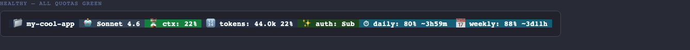
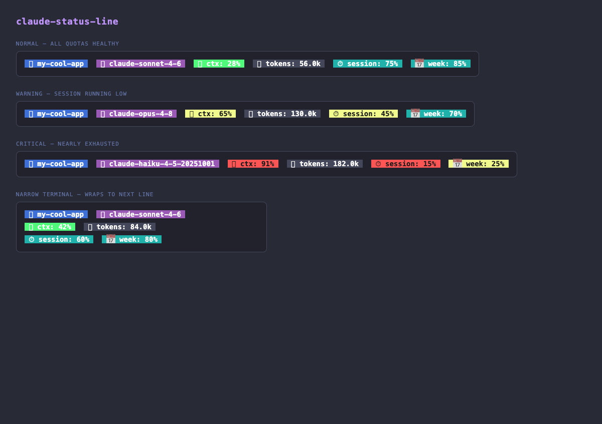
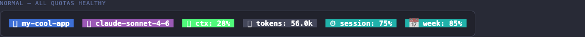
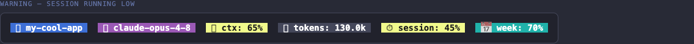
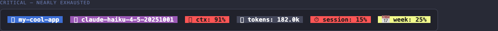
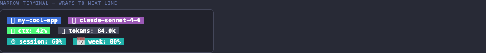

# claude-status-line

A Claude Code status line built with Bun/TypeScript. Shows real-time session info directly in your terminal status area.

## Demo

### Animated — all states cycling



### All scenarios at a glance



### Individual states

| Healthy | Warning |
|---|---|
|  |  |

| Critical | Narrow — wraps instead of truncating |
|---|---|
|  |  |

## What it shows

| Segment | Color | Description |
|---|---|---|
| **📁 folder** | Blue bg | Current working directory basename |
| **🤖 model** | Purple bg | Claude model name (e.g. `claude-sonnet-4-6`) |
| **ctx: N%** | Green/Yellow/Red bg | Context window usage % — turns yellow >60%, red >80% |
| **tokens: N** | Dark bg | Total input token count (formatted as `k` / `M`) |
| **session: N%** | Cyan/Yellow/Red bg | Remaining session quota % — turns yellow <50%, red <20% |
| **week: N%** | Cyan/Yellow/Red bg | Remaining weekly quota % |

If the content doesn't fit the terminal width it wraps to additional lines — **no info is ever truncated**.

## Setup (one command)

```bash
bunx barnuri/claude-status-line --setup
```

This writes the `statusLine` configuration into your `~/.claude/settings.json` (or `.claude/settings.json` if it exists in the current project). Restart Claude Code to activate.

Running `bunx barnuri/claude-status-line` interactively (without piped stdin) automatically launches the setup wizard.

## Manual configuration

Add this to your `~/.claude/settings.json`:

```json
{
  "statusLine": {
    "type": "command",
    "command": "bunx barnuri/claude-status-line",
    "refreshInterval": 2000
  }
}
```

## Regenerate preview screenshots

```bash
# Generate all preview images and the animated GIF in one command
bun run capture

# Or step by step:
bun run scripts/preview.ts          # → docs/preview.html
bun run scripts/animated-preview.ts # → docs/animated.html
bun run scripts/make-gif.ts         # → docs/demo.gif (from docs/frame-*.png)
```

Screenshots of individual scenarios are taken via Playwright MCP and saved to `docs/frame-*.png`. Use the `/capture-screenshots` Claude Code command to retake them.

## How it works

Claude Code pipes a `StatusJSON` blob to the command's stdin on every refresh. The tool parses it, extracts the relevant fields, and writes a colored, bold status line to stdout.

```
Claude Code runtime
    ↓  StatusJSON (stdin)
claude-status-line
    ↓  parse + extract metrics (StatusParser)
    ↓  render ANSI-colored segments with bold backgrounds (StatusRenderer)
    ↓  wrap to terminal width — never truncate
stdout → Claude Code status bar
```

## Development

```bash
# Run with test data
echo '{"model":"claude-sonnet-4-6","cwd":"/tmp","context_window":{"percentage":42,"tokens":85000},"rate_limits":{"session":{"used":50,"limit":100}}}' \
  | bun run src/index.ts

# Simulate narrow terminal (wrap behavior)
echo '{...}' | COLUMNS=40 bun run src/index.ts

# Run tests
bun test

# Run tests with coverage
bun test --coverage
```

## Verification

```bash
# All 52 tests pass with 100% line coverage
bun test --coverage

# Empty JSON → no output, exit 0
echo '{}' | bun run src/index.ts

# Setup wizard writes config
bun run src/index.ts --setup 2>&1 | grep "Status line configured"
```

## Requirements

- [Bun](https://bun.sh) ≥ 1.0
- Claude Code CLI

## License

MIT
